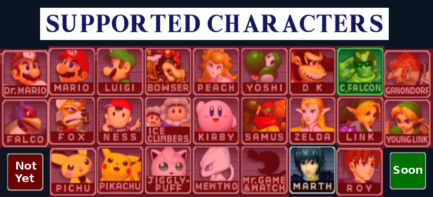
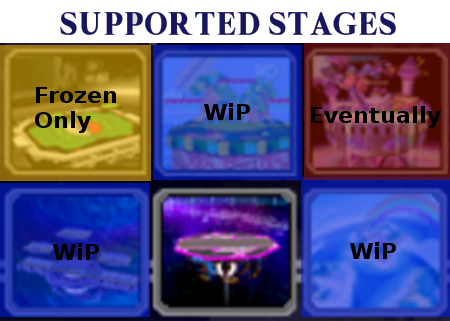

#SmashBot

##The AI that beats you at Melee

SmashBot is an AI that plays Super Smash Bros: Melee inside the Dolphin emulator. The goal is to make an AI that human beings cannot defeat.

##Sample Features

###Frame-Perfect Powershielding

###Punishes Laggy Moves

###Flowcharted Edgeguarding

###Short-Hop Double Laser

###Plus way more!

###Supported Characters and Stages

###FAQ

1. **What character does SmashBot play?**

    Fox, of course!

2. **Does SmashBot cheat?**

    The short answer is: No.

    The long answer is that SmashBot only interfaces with the game by pressing buttons on a virtual controller. There isn't anything it does that you **couldn't** do in principle. It just so happens, however, that a computer is much faster and more reliable than you, so it's able to do things that a human realistically can't.

3. **How is SmashBot designed?**

    SmashBot makes decisions on a 4 tiered hierarchy of objectives: Goals, Strategies, Tactics, and Chains. Each objective inspects the current game state and decides which lower level objective will be best to achieve it.

    **Goals** are the highest level objective, and inform the AI what the intended overall outcome should be. IE: Beating our opponent in a match, or navigating the menu to select our character.

    **Strategies** are the highest level means that the AI will use to accomplish the overall goal. For instance, the SmashBot will typically take the strategy of baiting the opponent into a poor move.

    **Tactics** are lowish level series of predictable circumstances that we can realistically flowchart our way through. For instance, if the enemy if off the stage we may choose to edge guard them to keep them from getting back on.

    **Chains** are the lowest level of objective that consists of a "chain" of button presses that Smashers will recognize, such as Wavedash, Jump-canceled Upsmash, etc...

4. **Can I play SmashBot on a regular Gamecube or hacked Wii?**

    For right now, SmashBot only runs on a PC as a normal computer program. (Meaning that Melee has to be in an emulator) But I do want to get it running on actual Gamecube/Wii hardware. If you'd like to help with this, let me know!

5. **What Operating Systems does it play on?**

    SmashBot runs on Linux/OSX currently. Under the hood, we use a named pipe input system to Dolphin, which is *nix only. There are no plans to make a Windows port. If we're going to spend time porting, it's going to be to a Gamecube/Wii.

6. **I found a bug. How can I help?**

    Hey thanks, that's awesome! For starters, make sure you can reliably reproduce the bug. Then go ahead and make an Issue on GitHub at https://github.com/altf4/SmashBot/issues. If you want to be even MORE awesome, run the AI with the "--debug" flag and upload the CSV file it gives you along with the issue. That CSV contains a full breakdown of the AI's state at each frame, so we can easily pinpoint what went wrong and where.

##Setup Steps:

1. Get a working copy of Dolphin 5.0 or greater. (4.x will not work) On Ubuntu, the easiest way will be to use the following PPA. First, add the following line to your software sources: (If you are not running Ubuntu 16.04, then change the "xenial" as necessary)
`deb http://ppa.launchpad.net/dolphin-emu/ppa/ubuntu xenial main`
Then run `sudo apt-get update` and `sudo apt-get install dolphin-emu`
2. You'll probably want a Wii U GameCube controller adapter. If you don't already have one, you can get one from Amazon here:
https://www.amazon.com/Super-Smash-GameCube-Adapter-Wii-U/dp/B00L3LQ1FI
3. Make sure you're running Melee v1.02 NTSC. Other versions will not work.
4. Apply the latest Melee Netplay Community Settings Gecko Code. It's available by default in Dolphin 5.0. SmashBot will NOT work properly without this. (Long story) You will need to enable cheat codes in Dolphin by choosing Config->General Tab->Enable Cheats. Then right click on the Melee game at the Dolphin home screen and go to Properties->Gecko Codes to find the Gecko Code list.
5. Apply "Press Y to toggle frozen stages" Gecko Code. If you want to play on Pokemon Stadium, use the frozen version.
6. Run `./smashbot.py`
7. Run dolphin and start up Melee.
8. Move focus over to the dolphin window. (Or else turn on background input on the controller) Just click on the dolphin window to do this.
9. Set player 1 to a supported character. (See above) SmashBot will choose its own character. Start the match.
